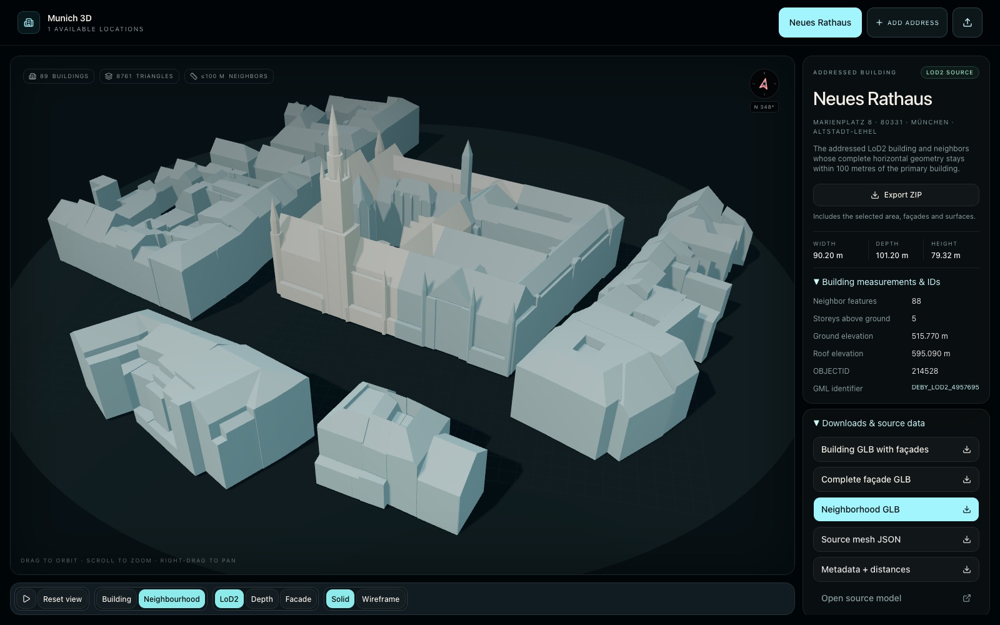
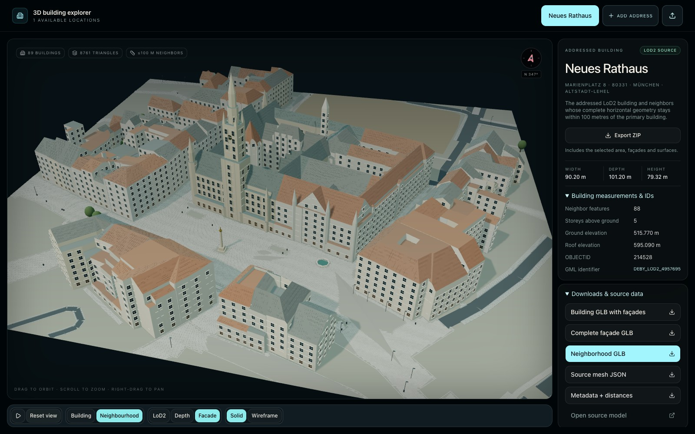
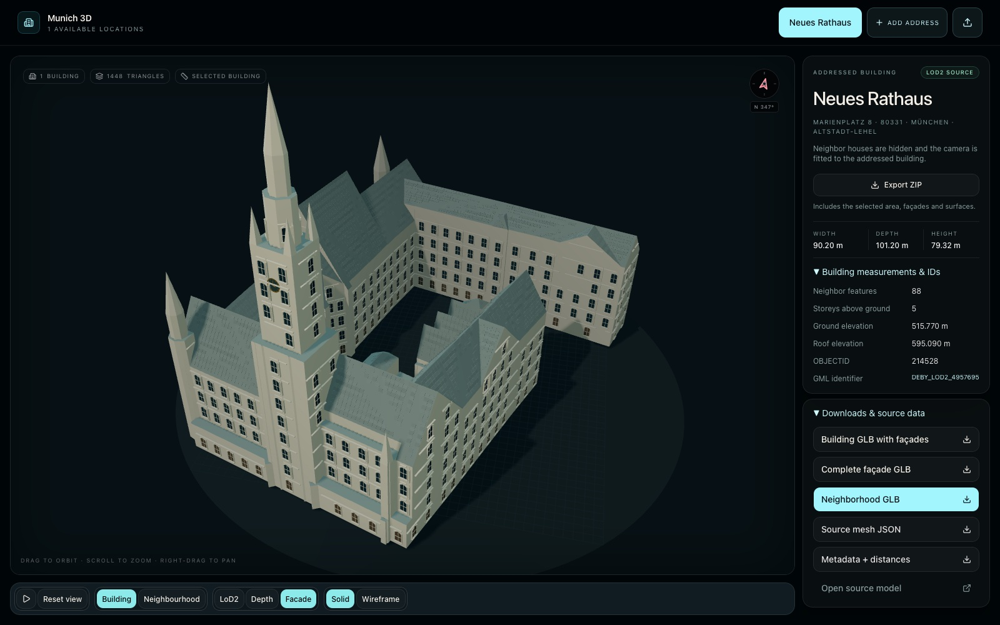
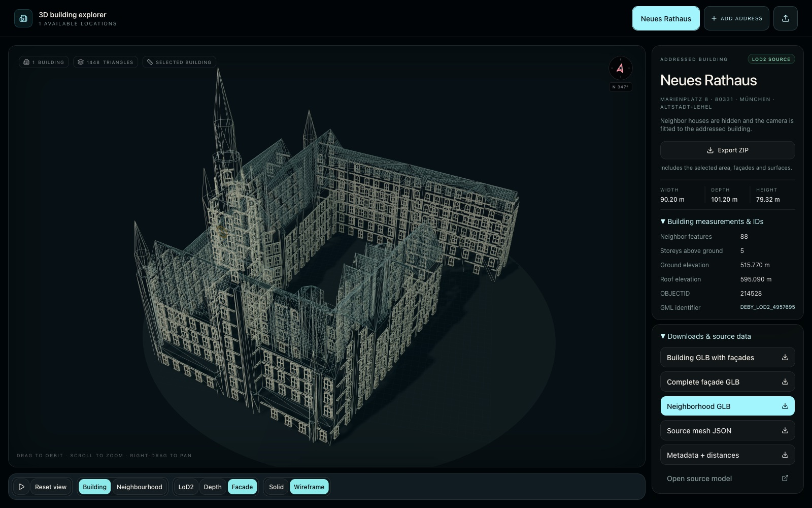
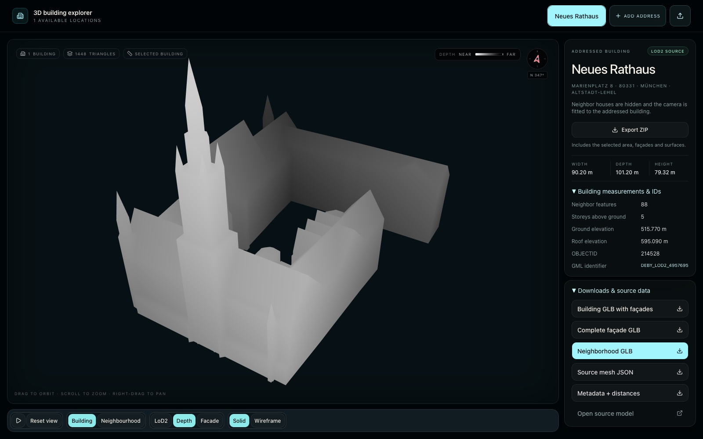
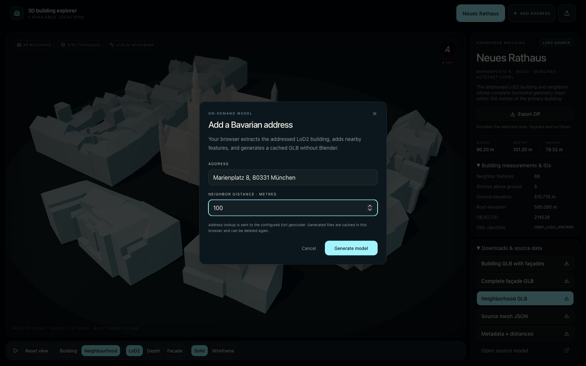

# Munich3D

Extract source-matched LoD2 buildings from Munich's ArcGIS scene or the statewide
BayernAtlas feed, export them to GLB, and explore them in Three.js. Optional
reconstructions add modeled facades, roofs and streets while keeping original
source geometry available for comparison and download.



## Run locally

Requires **Node.js 22.13 or newer**. New extractions need network access to the
geocoder and source services; existing permanent bundles are available locally.

```sh
cd website
npm install
npm run dev
```

Open [localhost:3000](http://localhost:3000/). The development server and generation
API bind to loopback. The default sample is **Rathaus 100 m** in original LoD2 mode.
The former Rathaus 35 m sample has been removed; old model links resolve to 100 m.

Other commands, from `website/`:

| Command | Purpose |
| --- | --- |
| `npm run models:catalog` | Regenerate per-address chooser metadata; also runs before development/build. |
| `npm run build` | Build the local website. |
| `npm start` | Build and serve with the local generation API. |
| `npm run lint` | Run the type-aware linter. |
| `npm run build:cloudflare` | Build static assets for `/munich3d/` and browser generation. |

## Explorer controls

Location buttons switch the model, dimensions, attributes, counts, source link
and downloads together. Models automatically fit the visible geometry; orbit,
pan and zoom are available in the scene.

The bottom row groups direct controls:

- **Rotation icon / Reset view**: rotation starts automatically; pause or resume
  it with the icon. Reset view restores the camera framing for the current
  Building / Neighbourhood scope without changing display mode or playback.
- **Building / Neighbourhood**: change visibility and fit the camera. Clicking
  the selected scope returns to its home framing. Explicitly grouped connected
  parts remain with the main building; independent neighbors hide in Building mode.
- **LoD2 / Depth / Facade**: original geometry, camera-relative grayscale depth,
  or illustrative reconstruction. Facade appears only when an area snapshot is
  available and preserves the current camera position.
- **Solid / Wireframe**: choose rendering independently, including reconstruction
  wireframe.

The right column opens its details by default and offers area-width choices when
multiple bundles exist. The compass follows camera orbit: X=east, Y=up, Z=south.
Downloads always contain the original GLB, source-mesh JSON and metadata JSON.

Links can select a model with `?model=MODEL_ID`; legacy `?area=MODEL_ID` also
selects it. Add `&view=reconstruction` to select Facade on initial load.

### Screenshots

Captured from the current homepage at 1600 × 1000 with only the public Rathaus
100 m bundle available. Private address names and assets are excluded. Click an
image to inspect it at full size; facade details are illustrative.

| Reconstructed neighbourhood | Building facade |
| --- | --- |
| [](docs/neighbourhood-facade.jpg) | [](docs/building-facade.jpg) |

| Reconstruction wireframe | Source depth |
| --- | --- |
| [](docs/reconstruction-wireframe.jpg) | [](docs/building-depth.jpg) |

### Generate an address

Choose **Add address**, enter a Bavarian address and a neighbor distance, then
wait for extraction. Repeating the same address and distance reuses the cache.
Generated models persist after reload and can be removed with **Delete generated
model**. Permanent bundles cannot be deleted through this action.



Locally, the Node server stores generated bundles in `website/.runtime/models/`.
In the Cloudflare build, a browser Web Worker runs the same extraction/export
pipeline and stores results in that browser's IndexedDB. Browser-generated
models are not uploaded or added to a public catalog. Address searches use the
configured Esri geocoder.

### Share an address as a ZIP

Use **Export ZIP** in the address column to download the selected area's original
GLB, source mesh and metadata, plus its complete façade and surface snapshot when
available. Neighbours and their authored façade profiles are included even when
Building mode is selected. Filenames include the address, area size and local
export timestamp. The archive preserves reconstruction reference notes;
external reference photos themselves are not bundled.

Send the ZIP to your friend. They can open [Munich3D](https://glaubi.net/munich3d/)
and choose the global **upload icon** (Import ZIP) beside **Add address**. It adds the
imported location to the address chooser and selects it, regardless of which
address was previously selected. Import also works on localhost.
The address is saved only in that browser's IndexedDB, survives reload and can be
re-exported or removed with the runtime-model delete control. No address data is
uploaded or added to the public catalog. Clearing browser storage removes imports.

Archives use the versioned `munich3d-address` format with SHA-256 file checksums.
Import validates the source bundle before saving; limits are 100 MB compressed
and 256 MB unpacked. ZIP processing runs in a worker.

## Files and privacy

```text
extract_buildings.mjs         CLI and shared geocoding/source-selection pipeline
import_bayernatlas.mjs        Shared statewide 3D Tiles importer
export_model_to_glb.mjs       CLI and shared source-mesh-to-GLB exporter
tests/                       Pipeline regression tests
website/
  server.mjs                 Loopback server and generation API
  src/App.tsx                Unified explorer and catalog discovery
  components/house-viewer.tsx Model loading, camera and interaction
  lib/area-reconstruction.ts Illustrative geometry and surface rendering
  lib/browser-models.ts      Browser generation and IndexedDB cache
  scripts/                   Catalog, surface preparation and validation tools
  addresses/<address>/
    model/                   <model>.glb, .metadata.json, .source-mesh.json
    area/                    Bounded OSM snapshots and optional facade profiles
    catalog/                 Generated <model>.json chooser fragments
  .runtime/                  Ignored local jobs and generated models
.work/                       Ignored extraction work and local reference material
```

Each address has one lowercase folder, containing all its distance variants.
Keep original bundle names and metadata intact. Catalog generation discovers
complete bundles and matching area snapshots by `modelId`; no separate model list
is maintained. Missing bundle members and duplicate model IDs fail generation.

Only `website/addresses/muenchner-rathaus/`, containing the 100 m sample, is
allowlisted for Git. Other address folders remain ignored together with their
catalogs, surfaces and profiles. **Git ignore is not a build filter:** a build
includes permanent assets present in the local checkout, including private ones.
Use a checkout containing only approved assets when publishing.

Do not remove private folders or reference material during cleanup. The three
root `.mjs` files are application source. Build output and browser-test artifacts
are reproducible; runtime models, local state and investigations may not be.

## Extract a permanent bundle

Run from the repository root:

```sh
node extract_buildings.mjs \
  --address "Münchner Rathaus, Marienplatz 8, 80331 München, Germany" \
  --neighbor-distance 100 \
  --output .work/muenchner-rathaus-100m
```

| Option | Meaning |
| --- | --- |
| `--address <text>` | Address to geocode; required unless coordinates are supplied. |
| `--coordinates <lat,lon>` | Explicit coordinates instead of geocoding. |
| `--neighbor-distance <metres>` | Neighbor cutoff; default **35 m**. |
| `--target-search-distance <m>` | Nearest-building fallback distance; default 25 m. |
| `--output <directory>` | Destination; otherwise `.work/<address-slug>/`. |
| `--item-id <id>` | Alternate ArcGIS scene item. |
| `--help` | Print command help. |

Extraction writes source-mesh JSON, metadata JSON, an OBJ and a reproduction
README. Export directly from the two JSON files, using the emitted filename
stem in place of `SOURCE_STEM`:

```sh
node export_model_to_glb.mjs \
  .work/muenchner-rathaus-100m/SOURCE_STEM.source-mesh.json \
  .work/muenchner-rathaus-100m/SOURCE_STEM.metadata.json \
  .work/muenchner-rathaus-100m/muenchner-rathaus-100m.glb
```

To install a new permanent bundle:

1. Inspect the selected primary building and recorded distance rule in metadata.
2. Place the GLB and both JSON files in `website/addresses/<address>/model/`,
   giving all three the same stable model stem. Retain source contents unchanged.
3. Keep OBJ and the extraction README out of the permanent bundle.
4. Run `npm run build --prefix website`; its catalog step discovers the bundle.
5. Verify selection, facts, source link and all three downloads in the browser.

### Source and selection rules

The default Munich source is ArcGIS item `afce63c0ee9a4a33b2c4ebd29a8e71ef`.
The extractor discovers its SceneServer and decodes I3S meshes. Outside that
item's extent, the shared pipeline uses BayernAtlas LoD2 3D Tiles. An explicit
`--item-id` keeps the requested I3S source. The BayernAtlas feed is a preview
service; unsupported formats fail explicitly.

Primary selection uses point intersection, falling back to the nearest building
within the target-search distance when needed; metadata records that fallback.
The primary is always retained. For new neighbors, the **farthest decoded
horizontal vertex** must be within the requested distance of primary geometry.
This is recorded as `complete_geometry_within_primary_distance`. Legacy bundles
may record `closest_geometry_from_primary`; their original rule remains authoritative.

Each GLB contains one node per source feature with its role, GML ID, OBJECTID and
distance extras. Vertices, triangle topology and roof forms remain source-matched.
Metadata supplies dimensions and attributes. BayernAtlas elevations are WGS84
ellipsoidal heights, labeled separately; absent OBJECTID/storeys remain unavailable.

## Reconstruction and surface preparation

Area snapshots associate optional reconstruction with a model. Windows, doors,
balconies, roof fixtures and paving are geometry, not projected photographs.
Openings and details modify a separate copy; LoD2 comparison restores the source.
Gothic detailing applies only to Rathaus. Other buildings use generic details or
local photo profiles with references and confidence notes. Estimated dimensions
and obscured elevations are not survey measurements.

Profiles use exact GML IDs: `primaryFacade` for the main feature,
`connectedFacades` for parts retained in Building mode, and `neighborFacades`
for independent neighbors. Details can include inset glazing, surrounds, shutters,
plank doors, gutters, flues, tiled roofs, solar panels and rooflights.

Bounded OSM snapshots supply mapped roads, plazas, paths, vegetation and transport
locations. Reconstruction adds paving joints, kerbs, drains, markings, street
furniture and surface rails/sleepers/ballast. Underground, removed and proposed
tracks are excluded. Ground interpolation, inferred widths and furniture shapes
remain approximations. Bench direction follows mapped bearings where available;
fallback directions toward nearby paths or platform tracks are inferred.

To refresh Rathaus surfaces from the repository root:

```sh
mkdir -p .work/rathaus-surfaces
curl --fail --max-time 55 --data-urlencode data@website/scripts/rathaus-surfaces.overpass \
  https://overpass-api.de/api/interpreter -o .work/rathaus-surfaces/osm.json
curl --fail --max-time 55 --data-urlencode data@website/scripts/rathaus-surface-details.overpass \
  https://overpass-api.de/api/interpreter -o .work/rathaus-surfaces/osm-details.json
node website/scripts/build-rathaus-surfaces.mjs \
  .work/rathaus-surfaces/osm.json .work/rathaus-surfaces/osm-details.json
```

For another bundle, supply ways and relations queried around **that model's
bounds**, using its model ID in place of `MODEL_ID`:

```sh
node website/scripts/fetch-area-transport.mjs MODEL_ID .work/transport.json
node website/scripts/build-area-surfaces.mjs MODEL_ID WAYS.json RELATIONS.json .work/transport.json
npm run models:catalog --prefix website
```

The transport argument is optional; `OVERPASS_URL` overrides the fetch endpoint.
The builder uses the matching source transform and preserves profiles whose
source IDs still match. Fetching is a preparation step, not required on page load.

## Local API and hosted build

| Route | Purpose |
| --- | --- |
| `GET /api/health` | Server/pipeline health. |
| `GET /api/models` | List valid cached runtime models. |
| `POST /api/models` | Generate/reuse `{ address, neighborDistance, coordinates?: [lat, lon] }`. |
| `DELETE /api/models/<local-id>` | Delete a completed runtime model only. |
| `GET /api/model-files/<local-id>/<file>` | Download GLB, source-mesh or metadata. |

Requests accept no output path. Addresses are 3–300 characters without C0
controls; neighbor distances are 0–250 m. Coordinates are validated and the
local API limits request bodies to 16 KiB. Browser generation shares address
and distance validation. Local extraction uses argument arrays without a shell.

The Cloudflare configuration serves only `glaubi.net/munich3d` and
`glaubi.net/munich3d/*`, with `workers_dev: false`. Its asset base is `/munich3d/`.
Hosted generation needs no server compute, Blender, child process or OBJ export.
### Automatic deployment

[Deploy Munich3D](.github/workflows/deploy.yml) runs on every push to `master`,
with a manual **Run workflow** option in GitHub Actions. It installs locked
packages, runs pipeline/reconstruction tests, checks that only the complete
Rathaus 100 m bundle is present, builds the Cloudflare site and deploys it.
A final check compares live HTML, entry assets and sample metadata with the build.
Failed tests or unexpected address assets block deployment. Runs are serialized.

The workflow uses the `CLOUDFLARE_ACCOUNT_ID` repository variable and the
`CLOUDFLARE_API_TOKEN` Actions secret. The token needs Workers Scripts Edit,
Workers Routes Edit for `glaubi.net`, and the account/zone read access used by
Wrangler; scope it to the deployment account and zone. Keep the token out of Git.
See [Cloudflare's GitHub Actions guide](https://developers.cloudflare.com/workers/ci-cd/external-cicd/github-actions/).

The CI checkout contains only committed assets. Local `npm run deploy:cloudflare`
also checks the public address boundary and fails when private folders are
present; deploy from a clean public checkout instead of deleting private data.
Pushing to `master` publishes automatically once the Actions secret is configured.

## Validation

Run checks appropriate to the changed code from the repository root:

```sh
node --check extract_buildings.mjs
node --check import_bayernatlas.mjs
node --check export_model_to_glb.mjs
node --test tests/bayernatlas.test.mjs
node --test website/scripts/address-bundles.test.mjs
node website/scripts/test-area-reconstruction.mjs
node website/scripts/test-area-camera.mjs
npm run build --prefix website
```

The area tests default to Rathaus 100 m and accept an optional model ID. They
check reconstruction/source separation and camera fitting at multiple aspect
ratios. Selection changes also require a second address and matching metadata,
source-mesh and GLB counts. Strict-distance neighbors must satisfy the recorded
maximum-distance cutoff.

Verify visible changes in a real browser: location switching, fitting, connected
building visibility, Facade camera stability, depth/wireframe, compass and a clean
console. Runtime changes additionally require cached/uncached generation,
downloads, deletion and reload persistence. See [AGENTS.md](AGENTS.md) for the
change-specific validation matrix.

## Attribution

Project website and original project content: **© 2026 Robert Zaufall**.

Building data: **Bayerische Vermessungsverwaltung – www.geodaten.bayern.de**,
CC BY 4.0. Area surface data: **© OpenStreetMap contributors**, ODbL 1.0.
Reconstruction details remain illustrative and separate from these source datasets.
