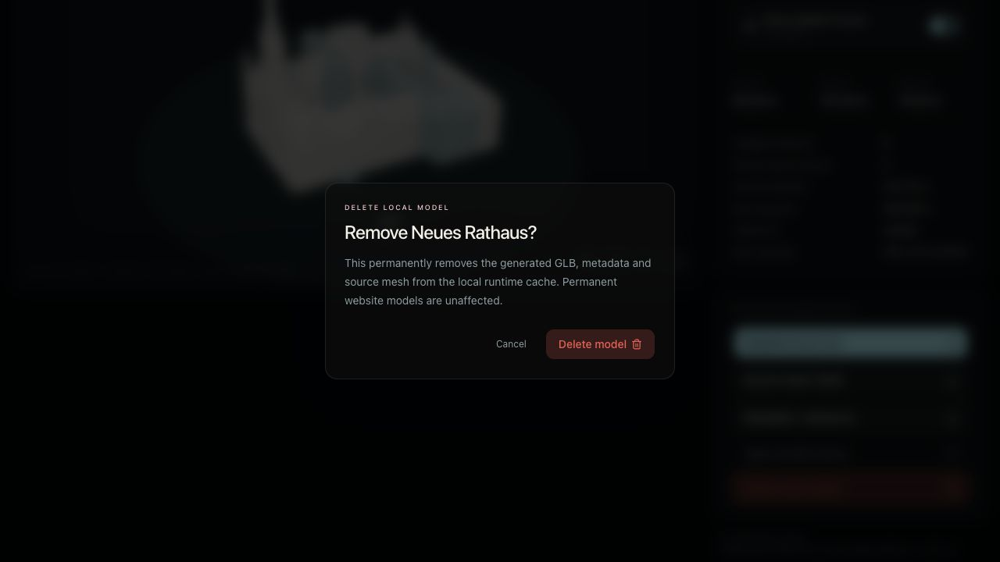

# Munich LoD2 building extractor and viewer

This project extracts addressed buildings from Munich’s public ArcGIS LoD2
scene, includes neighboring building features inside a configurable distance,
converts the results to GLB, and displays the available addresses in an
interactive local Three.js website.


The geometry comes from ArcGIS item `afce63c0ee9a4a33b2c4ebd29a8e71ef`.
The extractor discovers the item’s current SceneServer, traverses its I3S node
tree, decodes binary geometry and attributes, and exports source-matched model
data in local metre coordinates.

For new extractions, the neighbor cutoff is measured from the addressed
building: every decoded horizontal vertex of a neighbor must be within the
requested distance of the primary geometry. This prevents a large or distant
building from qualifying only because one nearby edge crosses the cutoff.
Each bundle records its selection rule in metadata. The checked-in Rathaus
sample predates this strict rule and therefore reports the legacy
`closest_geometry_from_primary` mode; on-demand and newly extracted models use
`complete_geometry_within_primary_distance`.

## Repository layout

```text
extract_buildings.mjs       Runtime-required geocoding, I3S selection and export
export_model_to_glb.mjs     Runtime-required source-mesh JSON to GLB generation
website/                    Local Vite/React/Three.js viewer
website/server.mjs          Loopback web server and on-demand generation API
website/public/model/       GLBs and downloadable data used by the viewer
website/lib/model-catalog/  One generated catalog fragment per model bundle
website/scripts/            Automatic website catalog-fragment generation
AGENTS.md                    Project workflow and correctness rules
```

The two root `.mjs` files are application source, not generated leftovers:
`website/server.mjs` launches them in sequence for every uncached on-demand
address.

## Requirements

- Node.js 22.13 or newer for extraction, GLB generation and the website.
- Network access to the ArcGIS item, SceneServer and Esri geocoder when
  extracting a new address.

The extractor itself uses only Node.js built-ins.

## Extract building data

```sh
node extract_buildings.mjs \
  --address "Münchner Rathaus, Marienplatz 8, 80331 München, Germany" \
  --neighbor-distance 35 \
  --output .work/muenchner-rathaus-35m
```

Available options:

```text
--address <text>                  Address to geocode
--coordinates <lat,lon>          Optional coordinate override
--neighbor-distance <metres>     Neighbor cutoff; default 35
--target-search-distance <m>     Address-point fallback; default 25
--output <directory>             Explicit destination directory
--item-id <id>                   Alternate ArcGIS Scene Service item
--help                            Show command help
```

If `--output` is omitted, files are written to
`.work/<matched-address-slug>/`. The `.work/` directory is ignored because its
contents are reproducible intermediates.

### Generated address dataset

Each extraction writes:

- `<address>.obj`: combined local-metre OBJ with one named object per building.
- `<address>.source-mesh.json`: decoded source-exact vertices, normals, UVs,
  colors and triangles for every selected feature.
- `<address>.metadata.json`: input parameters, geocoder result, primary
  selection, source attributes, transforms, closest neighbor distances and,
  for current strict-distance exports, each feature's farthest decoded-vertex
  distance from the primary building.
- `README.md`: per-export building table and reproduction command.

The addressed building is selected by point intersection. If a geocoder point
falls just outside the footprint, the closest building inside
`--target-search-distance` is used and the fallback is recorded in metadata.

## Generate an address dataset GLB

Generate the GLB directly from the source-mesh and metadata JSON:

```sh
node export_model_to_glb.mjs \
  .work/muenchner-rathaus-35m/ADDRESS.source-mesh.json \
  .work/muenchner-rathaus-35m/ADDRESS.metadata.json \
  website/public/model/muenchner-rathaus-35m.glb
```

Replace `ADDRESS` with the filename stem emitted by the extractor. Both JSON
inputs share that stem.

The resulting GLB contains one node per building. The primary building uses a
warm stone material and neighboring features use blue-grey. Each node preserves
its role, GML ID, OBJECTID, closest distance and—when present in metadata—its
farthest distance from the primary building as glTF extras. The direct exporter
retains source normals, UV coordinates and vertex colors and uses only Node.js
built-ins.

## Three.js website

The local website is in `website/`. Its address switcher changes the following
as one consistent view:

- neighborhood GLB;
- primary-building dimensions and attributes;
- building and triangle counts;
- ArcGIS source location;
- GLB, source-mesh JSON and metadata download targets.

The addressed building is highlighted in warm stone and neighbors are shown in
blue-grey. Every model load automatically fits the camera to the visible
geometry. The viewer supports orbit, zoom, pan, camera reset, rotation pause,
wireframe mode, a camera-relative grayscale depth-map mode, and a neighbor-house
switch that hides neighbors and refits the camera to the primary building. A
camera-linked compass keeps geographic north visible while orbiting. The
circular ground plate and grid recenter and resize from the currently visible
model footprint instead of using one fixed size for every address.

### Generate an address on demand


Select **Add address**, enter a Munich address and choose the neighbor distance.
The loopback-only local server then:

1. validates the request without accepting a filesystem path;
2. extracts the matching LoD2 geometry from ArcGIS;
3. generates the GLB directly with Node.js;
4. stores the GLB, source-mesh JSON and metadata JSON in
   `website/.runtime/models/` and discards reproducible OBJ/README intermediates;
5. selects the result and keeps it available after a page reload.

Requests with the same address and distance reuse their cached result. Runtime
models are discovered through `/api/models`, served through same-origin API
URLs and ignored by Git. The address is sent to the configured Esri geocoder;
the generated files remain local. Select a generated model and use **Delete
local model** to remove its cached GLB and source data; permanent models in
`website/public/model/` do not expose that action.



The screenshots intentionally show different neighbor counts: the permanent
Rathaus sample retains its recorded legacy closest-geometry selection, while
the generated deletion example uses the current strict farthest-vertex rule.

### Run locally

```sh
cd website
npm install
npm run dev
```

Open [http://localhost:3000/](http://localhost:3000/).

Create a production build with:

```sh
npm run build
```

Run the production build with the same local generation API using:

```sh
npm start
```

Run the type-aware linter with `npm run lint`.

### Local generation API

The loopback server exposes these same-origin routes for the website:

- `GET /api/health`: report server and GLB-pipeline health.
- `GET /api/models`: list valid cached runtime models.
- `POST /api/models`: generate or reuse a model from an `address`,
  `neighborDistance`, and optional `[latitude, longitude]` coordinates.
- `DELETE /api/models/<local-id>`: remove a completed runtime model only.
- `GET /api/model-files/<local-id>/<file>`: download its GLB, source-mesh JSON,
  or metadata JSON.

Generation requests are limited to 16 KiB; addresses must contain 3–300
characters without C0 control characters, and neighbor distances must be
between 0 and 250 metres. The server binds to `127.0.0.1` and is not intended
to be exposed publicly.

### Website model assets

For every permanent selectable address, `website/public/model/` contains:

```text
<address>-35m.glb
<address>-35m.metadata.json
<address>-35m.source-mesh.json
```

The GLB is rendered by Three.js. The JSON files are downloadable provenance and
source-data artifacts. Before development or production builds,
`website/scripts/build-model-catalog.mjs` discovers every complete bundle and
regenerates one `website/lib/model-catalog/<address>.json` fragment per model.
The app discovers the available fragments at build time, so there is no shared
catalog file containing every address. The chooser, dimensions, attributes,
counts, distances, source link and downloads all come from these fragments.
`website/components/house-viewer.tsx` owns loading, camera framing and
interaction.

Git tracks only the `muenchner-rathaus-35m` bundle and its JSON fragment. The
root `.gitignore` excludes other local model bundles and their address-bearing
catalog fragments, but those complete bundles remain available in the local
website chooser.

Catalog generation fails if any model stem lacks its GLB, metadata JSON or
source-mesh JSON, preventing an incomplete model from being silently omitted.

## Add another address manually

1. Run `extract_buildings.mjs` with the new address and desired neighbor cutoff
   in `.work/` or another temporary directory.
2. Inspect the generated metadata, confirm the selection mode is
   `complete_geometry_within_primary_distance`, and confirm every neighbor's
   `maximumDistanceFromPrimaryMetres` satisfies the cutoff.
3. Generate the GLB from the source-mesh and metadata JSON with
   `export_model_to_glb.mjs`.
4. Copy the metadata JSON and source-mesh JSON beside the GLB in
   `website/public/model/` using one stable lowercase stem. The OBJ and
   extraction README do not need to be retained.
5. Run `npm run build`. Its `prebuild` hook discovers the new bundle and updates
   the chooser automatically. `npm run dev` does the same through `predev`.
6. Verify every selector state and download in a real
   browser with a clean console.

The manual workflow creates a permanent model bundle in
`website/public/model/`. For ordinary local exploration, use the on-demand form
instead; it requires no copying or catalog command.

## Validation expectations

- `node --check extract_buildings.mjs` and
  `node --check export_model_to_glb.mjs` succeed.
- Source-mesh JSON, metadata and GLB building counts agree.
- For a current strict-distance bundle, every neighbor's
  `maximumDistanceFromPrimaryMetres` is within the requested distance from the
  primary building. Legacy bundles must instead retain and disclose their
  recorded selection mode.
- GLB node roles contain exactly one primary and the expected neighbors.
- `npm run build` succeeds after website changes.
- `/api/health` reports `direct-node-glb`, and an uncached `/api/models` request
  completes extraction and returns a loadable GLB bundle.
- All current address choices update the model and associated information
  without reloading the page.

## Copyright and data attribution

Project website and original project content: **© 2026 Robert Zaufall**.

The building geometry is provided under CC BY 4.0. Required attribution:
**Bayerische Vermessungsverwaltung – www.geodaten.bayern.de**.
